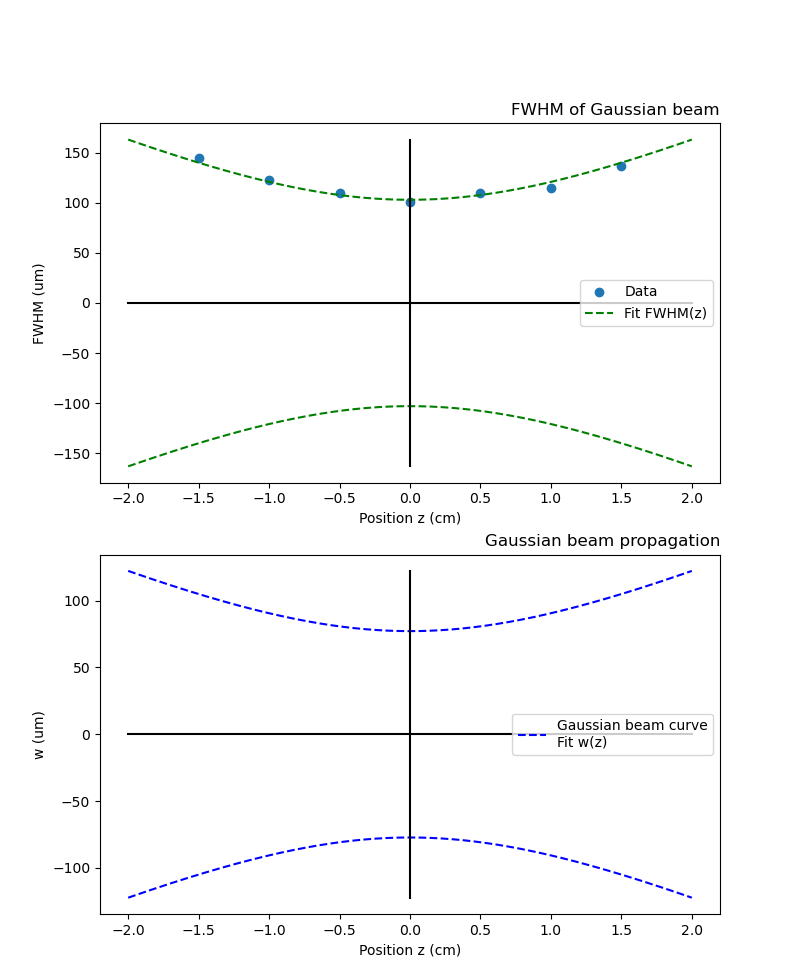

# 高斯光束拟合

# 高斯光束传播曲线拟合

## 简介

本项目将介绍如何使用 Python 中的 `scipy.optimize.curve_fit` 函数来拟合高斯光束传播曲线，并通过可视化图表展示拟合结果。本文涉及的主要知识点包括：

- 高斯光束传播函数
- FWHM 与光束尺寸的转换
- 初始参数猜测
- 高斯光束传播曲线拟合
- 可视化拟合结果

## 高斯光束传播函数

高斯光束是一类呈钟形分布的光束，其传播过程可以使用下面这个公式描述：

$$
w(z) = w_0\sqrt{1+\left(\frac{z}{z_R}\right)^2}
$$

其中：

- $z$ 为光束传播方向距离某一参考位置的距离（也称为光轴），可以是正数或负数。
- $w_0$ 为光束在腰部（即光束尺寸最小点）处的半径。
- $z_R$  为 Rayleigh 范围，表示若干倍的 $w_0$，在这个范围内光束尺寸约为  $w_0$ 的 $\sqrt{2}$ 倍。

## FWHM 与光束尺寸的转换

在实际中，人们往往使用光束的 **FWHM** 来描述光束尺寸。**FWHM** 是 **Full Width at Half Maximum** 的缩写，即光束强度最大点两侧光强下降到一半时对应的两个位置之差。而光束尺寸 $w$ 和 FWHM 的关系可以用下面这个公式表示：

$$
\mathrm{FWHM} = \frac{w\pi}{ 2\sqrt{2\ln(2)}}
$$

$$
\mathrm{FWHM} = 1.17 w
$$

## 初始参数猜测

在拟合高斯光束传播曲线时，需要给出初值参数的估计值，以便计算得到更准确的拟合结果。这些初值参数包括：

- 腰半径 $w_0$的初始估计值
- Rayleigh 范围$z_R$ 的初始估计值，我们将其设置为 $z_R = \pi w_0^2/\lambda$，其中 $\lambda$ 为光波长。

初值参数的估计值应该根据具体情况进行选择，从而更好地拟合数据。

## 高斯光束传播曲线拟合

使用 Python 中的 `scipy.optimize.curve_fit` 函数可以对高斯光束传播曲线进行非线性最小二乘拟合。拟合的函数定义如下：

```python
# w(z)函数
def w_z(z, w0, zR):
    w = w0 * np.sqrt(1 + (z / zR)**2)
    return w
```

其中 $z$ 为位置，$w_0,z_R$为带拟合参数的参量。`curve_fit` 函数的调用方式为：

```python
popt, pcov = curve_fit(w_z, z, w, p0=[w0_guess, zR_guess])
```

这里 `p0` 参数为估计初始值。

## 可视化拟合结果

最后，我们将使用 `Matplotlib` 库对拟合结果进行可视化展示。以下是具体可视化过程的相关代码：

```python
# 绘制拟合结果
w_fit = w_z(z, *popt)  # 根据拟合参数计算出拟合曲线
FWHM_fit = w_to_FWHM(w_fit)  # 将拟合结果转换为 FWHM

plt.figure(figsize=(8, 20))
plt.subplot(2, 1, 1)
z_plot = np.linspace(-0.02, 0.02, 500)
w_plot =  w_z(z_plot, *popt)
FWHM_plot = w_to_FWHM(w_plot)

plt.plot(z*1e2, FWHM*1e6, 'o', label="Data")  # 绘制数据点
plt.plot(z_plot*1e2, FWHM_plot*1e6, 'g--',label="Fit FWHM(z)")  # 绘制拟合曲线
plt.plot(z_plot*1e2, -1*FWHM_plot*1e6, 'g--')  # 绘制拟合曲线

# 绘制x，y坐标轴
plt.plot([0, 0], [-1*max(FWHM_plot*1e6), max(FWHM_plot*1e6)], 'k-')
plt.plot([-1*max(z_plot*1e2), max(z_plot*1e2)], [0, 0], 'k-')

plt.xlabel("Position z (cm)")
plt.ylabel("FWHM (um)")
plt.legend()
plt.title("FWHM of Gaussian beam", loc='right')

# 可视化光束半径结果
plt.subplot(2, 1, 2)
# 绘制高斯光束传播曲线
z_plot = np.linspace(-0.02, 0.02, 500)
w_plot = w0_fit * np.sqrt(1 + (z_plot / zR_fit)**2)
plt.plot(z_plot*1e2, w_plot*1e6, 'b--', label="Gaussian beam curve\\nFit w(z)")
plt.plot(z_plot*1e2, w_plot*(-1)*1e6, 'b--')

# 绘制x，y坐标轴
plt.plot([0, 0], [-1*max(w_plot*1e6), max(w_plot*1e6)], 'k-')
plt.plot([-1*max(z_plot*1e2), max(z_plot*1e2)], [0, 0], 'k-')

plt.xlabel("Position z (cm)")
plt.ylabel("w (um)")
plt.title("Gaussian beam propagation", loc='right')
plt.legend()
plt.show()

```

通过运行以上代码，我们可以得到以下两张可视化结果图：



## 总结

介绍了如何使用 Python 中的 `scipy.optimize.curve_fit` 函数和 Matplotlib 库来拟合高斯光束传播曲线，并进行可视化。在具体实现过程中，我们涉及到了高斯光束传播函数、 FWHM 与光束尺寸的转换、初始参数猜测等多个知识点。